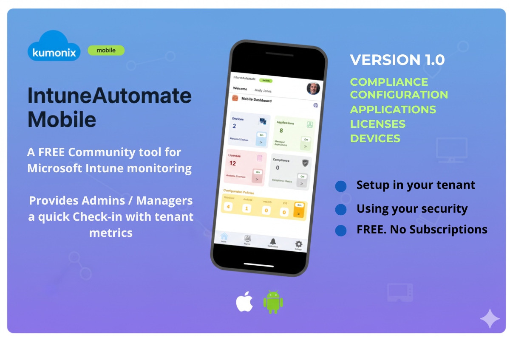

# IntuneAutomateMobile
Access Microsoft Intune tenant metrics quickly on the go

# 🚀 Your Microsoft focused Intune Check-In App

Welcome to the **The Community driven tool for Microsoft first environments**!  
This repository contains a Microsoft solution for quick insights into your Intune tenant. Quickly check-in for your compliance, configuration, licensing, applications and devices from the mobile.

---

## 📚 Table of Contents
- [🎯 Purpose](#-purpose)
- [✅ Features Included](#-features-included)
- [📁 Future Functionality](#-future-functionality)
- [🤝 Community Contribution](#-community-contribution)
- [📌 How to Get Started](#-how-to-get-started)
- [🏷️ Tags](#-tags)

---

## 🎯 **Purpose**

IntuneAutomate makes gaining quick insights into your Microsoft Intune tenant simple and secure. While Intune is powerful, sometimes you need fast, actionable data without extra complexity.
This solution is Microsoft-focused and runs entirely within your own tenant, leveraging your existing security posture—no external subscriptions required.
A ready-to-use automation toolkit built using:
 
- **x1 SharePoint List**  
- **Microsoft Power Automate**  
- **Microsoft Power Application**  
- **Microsoft Intune**    

Our goal is to **simplify access to Intune data** be that as a manager or It Admin and improve quick access to compliance, Licensing, Applications registered, policies deployed and device status — all while leveraging tools you already have in Microsoft 365.

---

## ✅ **GitHub**

This repository currently includes **Three directories** to help you deploy in your environment: Setup guide, Power platform solution, SharePoint List (data source).

### 1. Compliance
- Check-In with your compliance insights to see the status of your devices. Allows you make quick decisions.

### 2. Configuration
- Your Intune policies work across your device estate. This App gives you a quick check on those policies deployed and when this changes (to be added). 

### 3. Licenses
- Productivity is delivered through functionality and thats where Licensing comes in. Keep track of your license availability and assignments.

### 4. Devices
- See how many devices and there types you have and their current status. 
---

## 🤝 Future Functionality

**Multiple new features Incoming**.
- Deeper insights to policies deployed
- Security and compliance notifications and Alerts
- The numbers around Applications in your estate
- Enhanced policy knowledge captured changes 

## 🤝 Community Contribution

This is an **open community project**. We welcome:
- Contributions (new features, bug fixes, enhancements)
- Ideas for additional features and functionality
- Feedback and best practices

Please see our [CONTRIBUTING.md](./CONTRIBUTING.md) for guidelines on how to get involved.

---

## 📌 **How to Get Started**

1. Clone or download this repository.
2. Import the provided **Power solution** into your environment.
3. Configure connections for Microsoft 365 services.
4. Customise to fit your organization’s needs in your own tenant.

---
